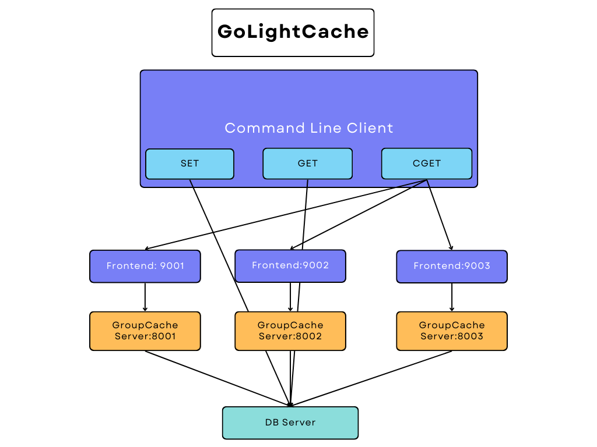

# GoLightCache: A High-Performance Caching System
> ✨Inspired by [GeeCache](https://geektutu.com/post/geecache.html)✨

A standalone **Golang distributed caching system**, utilizing **gRPC and etcd** for efficient cache management and network communication.

- Implemented the **LRU and LFU** algorithm to optimize cache storage by automatically discarding the least accessed items, enhancing system performance and resource utilization.
- Engineered **gRPC-based** distributed cache to enable multiple nodes to work together, improving system scalability and fault tolerance.
- Applied **Consistent Hashing** for node selection within the distributed system, ensuring effective load balancing and improving scalability and fault tolerance.
- Integrated **Protocol Buffers (protobuf)** for node communication, optimizing binary data exchange to reduce latency and bandwidth usage, resulting in faster response times and improved overall efficiency.
- Utilized **etcd** for service registration and discovery, enabling nodes to automatically discover each other and work together, improving system scalability and fault tolerance.

Improvements on GeeCache:
- Add **LFU** algorithm to cache
- Add **ttl** and **lazy delete** to cache
- Add **grpc** to communicate between nodes
- Add **etcd** to register and discover nodes

# Project Workflow


# Project Structure Tree
```bash
│  go.mod
│  go.sum
│  main.go	main函数,用于测试
│  README.md	MD文档
│  run.sh	Linux下测试
│
└─geecache
    │  byteview.go	缓存值的抽象与封装
    │  cache.go	并发控制
    │  geecache.go	负责与外部交互，控制缓存存储和获取的主流程
    │  geecache_test.go 			
    │  peers.go	抽象 PeerPicker
    │  grpc.go	Server和Client的实现
    │
    ├─consistenthash
    │      consistenthash.go	一致性哈希算法
    │      consistenthash_test.go	
    │
    ├─geecachepb
    │      geecachepb.pb.go
    │      geecachepb.proto	protobuf文件
    │      geecachepb_grpc.pb.go
    │
    ├─lfu
    │      lfu.go	LFU算法
    │      lfu_test.go
    │
    ├─lru
    │      lru.go	LRU算法
    │      lru_test.go
    │
    ├─registry	
    │      discover.go	服务发现
    │      register.go	服务注册
    │
    └─singleflight
            singleflight.go	防止缓存击穿
            singleflight_test.go
```